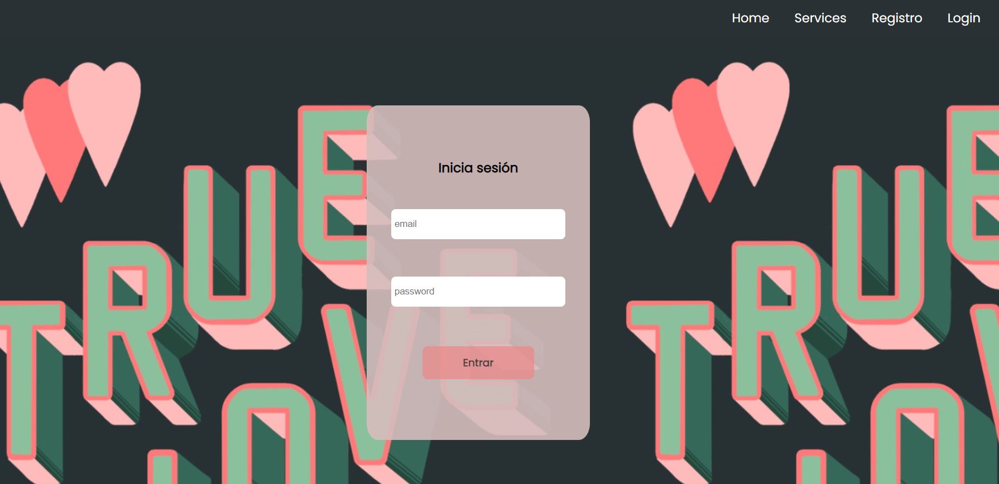

<div align=center>

# Proyecto de Frontend





## Tattoo Studio

 En este proyeto se nos requería el frontend  de un estudio de tatuaje que conecta  con una Api que desarrollamos en el anterior proyecto, ambos realizados como parte del Bootcamp Full Stack Developer de [](https://geekshubsacademy.com/)

<div align="center">
<a href="https://es.react.dev/">
    
</a>
<a href="https://developer.mozilla.org/es/docs/Web/CSS">
    
</a>
<a href="https://www.npmjs.com/">
    
</a>
<a href="https://developer.mozilla.org/es/docs/Web/JavaScript">
    
</a>
<a href="https://jwt.io/">
    
</a>
 </div>

 ## Tabla de Contenidos
- 🎯[Objetivo del proyecto](#objetivo-del-proyecto)
- ⚙️[Enlace proyyecto Backend](https://github.com/klauha/proyecto4-API-buscador-backend)
- ⚙️[Instalacion en local](#einstalacion-en-local)
- 💻[Librerias independientes](#Librerias-independientes)
- 💻[Contacto](#contacto)
- 🪪[Creditos](#creditos)

## Objetivo

Unificar nuestro backend con el forntend y hacer una app full-stack

App para la gestión de un estudio de tatuajes que nos permite registrarnos como usuarios, loguearnos como usuarios, crear citas, listar citas, eliminar citas,  acceder a nuestro perfil y modificar datos. Tambien podemos acceder como usuarios con el role super_admin y listar usuarios y eliminarlos. 

## Instalación
Primero deberemos clonar nuestro repositorio backend y seguir las instrucciones del readme:
https://github.com/klauha/proyecto4-API-buscador-backend

A continuación deberemos seguir los siguientes pasos para este repositorio

``` sh
$ git clone https://github.com/klauha/react-template.git
$ cd react-template
$ npm i
$ npm run dev 
```

## Librerias independientes

[react-jwt](https://www.npmjs.com/package/react-jwt)
[react-data-table-component](https://react-data-table-component.netlify.app/?path=/docs/getting-started-intro--docs)
[react-router-dom](https://reactrouter.com/en/main)

## Contacto

[](mailto:claudiaalvaro17@gmail.com)[](https://www.linkedin.com/in/vanessabritogonzalezhttps://www.linkedin.com/in/claudia-alvaro-cano-47860538/)

## Créditos
Este proyecto ha sido realizado por mi, Claudia Álvaro, como parte del Bootcamp Full Stack Developer de [](https://geekshubsacademy.com/)